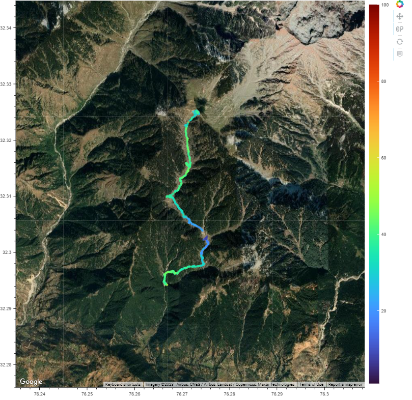

# Summary

SenGeo is a Python script developed to process and visually represent locally logged sensor data on Google Maps. This script is designed to seamlessly integrate collected sensor data, which includes essential attributes like latitude, longitude, and various measurements such as temperature, humidity, and PM2.5 and PM10 particle concentrations. By harnessing Python and Google Maps API, SenGeo provides a user-friendly method to visualize sensor data within its geographical context.

SenGeo processes the collected sensor data within a Python environment. The data, containing crucial attributes, are structured into a data frame for streamlined analysis. The script utilizes the Google Maps API to incorporate sensor data into the map interface. This integration facilitates the visualization of sensor readings in a geographic context.

SenGeo reads the latitude and longitude coordinates associated with each data entry. It then plots the data points on Google Maps at their locations. The script visualizes the sensor data using a color contour approach. This lets users grasp the intensity of measured attributes (e.g., temperature, humidity, particulate matter) in specific areas at a glance.

The script improves comprehension by combining data with Google Maps and displaying it within its spatial context. SenGeo's simple Python code and interaction with Google Maps API make it accessible to many users. SenGeo enables diverse sectors to make educated decisions based on dynamic environmental data trends by allowing users to see parameters like temperature, humidity, and particulate matter intensity using color contours.

# Statement of need

In recent years, the increasing concern over air quality and its impact on public health has led to the widespread deployment of mobile particulate matter (PM) sensors. These sensors provide valuable data on the concentration of particulate matter in different geographical locations. However, the effective utilization of this data requires a robust data visualization tool that can transform complex sensor readings into insightful visual representations. This statement of need outlines the necessity and significance of developing a specialized data visualization tool for geotagged particulate matter sensors. The data collected from mobile PM sensors holds immense potential for various stakeholders, including environmental researchers, public health officials, urban planners, and concerned citizens. The ability to visualize this data in a comprehensive and user-friendly manner is crucial for informed decision-making and effective policy formulation. While raw sensor data provides accurate measurements, its interpretation becomes a challenge without meaningful visualization. A dedicated data visualization tool tailored to the unique characteristics of geotagged PM sensor data would bridge this gap and empower users to make informed choices.

# Acknowledgements

We thank Saran Raj for helping us in carrying out the experiments related to this project. This work
was generously supported by Quest Lab, IIT Delhi.

# References
